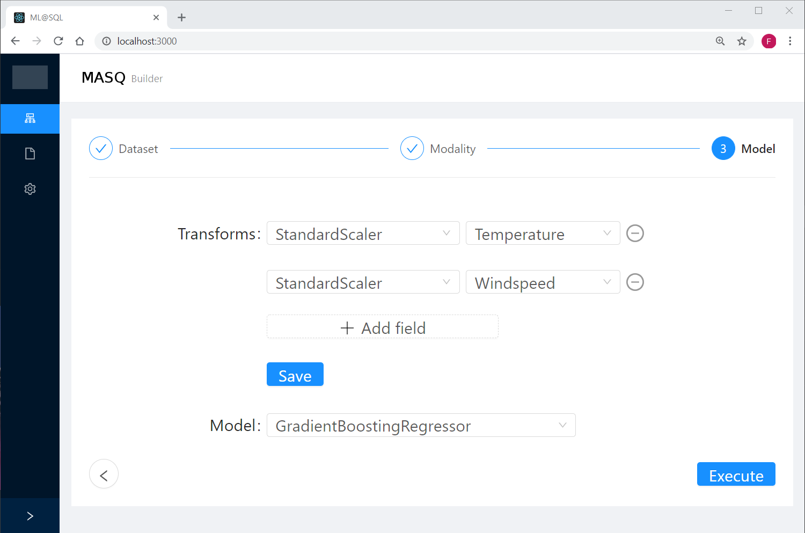
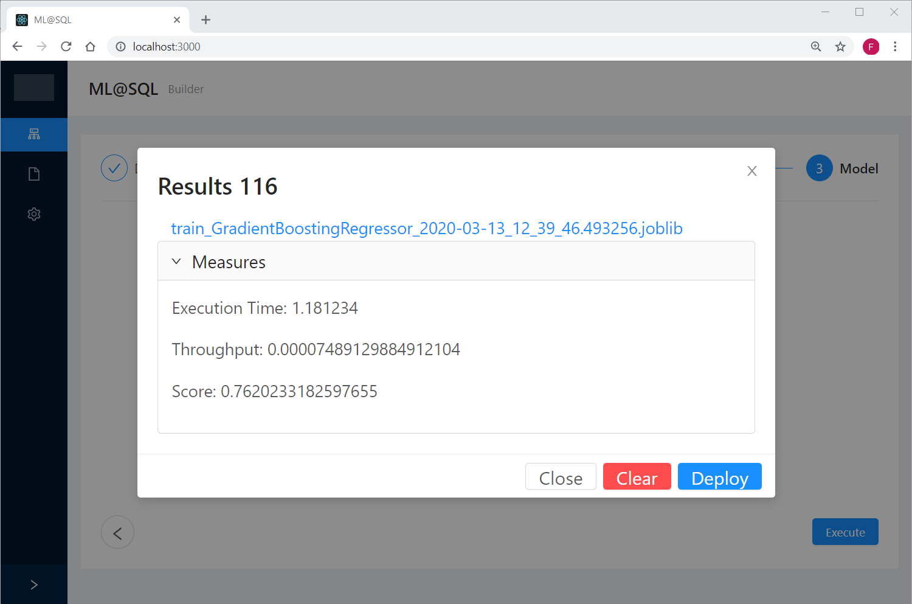
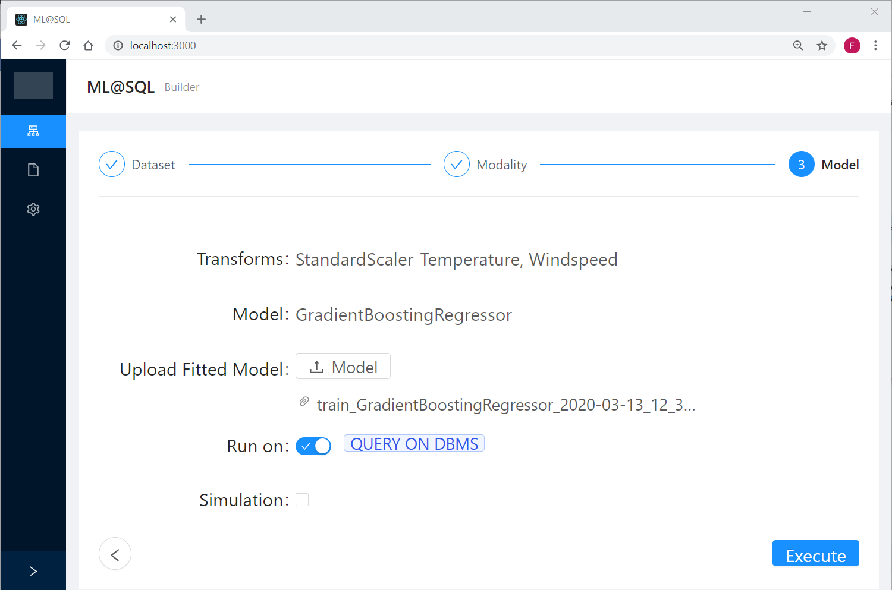
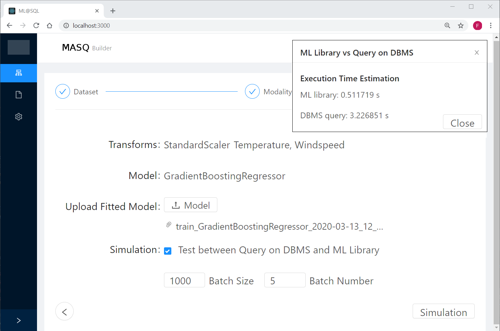
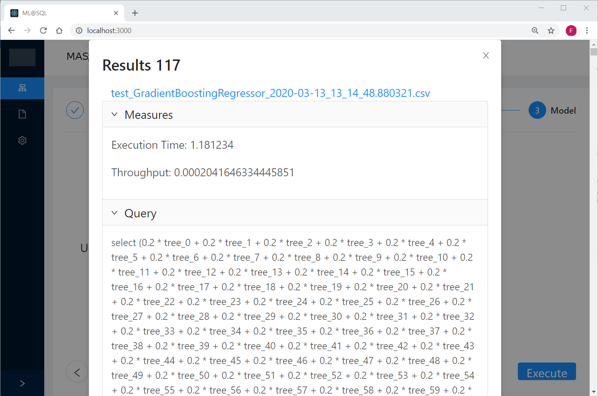

# MASQ frontend
The frontend is part of the _MASQ Project_. The frontend enables users to interact with the [MASQ platform](https://github.com/FrancescoDelBuono/MASQ).

More information about the [MASQ platform](https://github.com/FrancescoDelBuono/MASQ) can be found in the corresponding repository.

The MASQ frontend is supplied under MIT License. You can use and extend the frontend to interact with the MASQ platform.

## Prerequisites

### Install Node JS
Refer to https://nodejs.org/en/ to install nodejs

## Cloning and Running the Application in local

Clone the project into local

Install all the npm packages. Go into the project folder and type the following command to install all npm packages

```bash
npm install
```

In order to run the application type the following command

```bash
npm start
```

The Application Runs on **localhost:3000**


## Screenshot


### Pipeline

The MASQ pipeline is composed of three step:

1. **Dataset selection**: the user can both upload dataset (csv format) and insert DBMS connection detail
2. **Modality selection**: selection between train and test step with label definition
3. **ML pipeline construction**: in training phase the user build the desired pipeline with transforms and model, 
instead in testing phase the user upload the fitted pipeline and can decide to generate and execute the ML query on selected DBMS

#### Train

ML pipeline construction



ML pipeline train and deploy



#### Test

ML pipeline testing step



Simulation estimated execution time between query and ml library 



Query generation 


